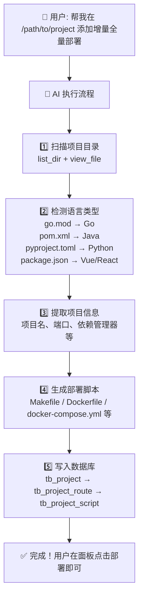

# Phase 1 实施方案：AI 自动维护项目 + 部署脚本

> **目标**：用户只需告诉 AI 一个本地项目路径，AI 就能自动在 easy-deploy 中创建项目、路由、脚本，用户手动触发部署。
> 
> **代码改动量**：**零** —— 不改后端、不改前端，AI 直接操作数据库。

## 一、整体流程



## 二、AI 操作数据库的方式

通过 Docker 执行 psql 命令：

```bash
docker exec postgres16 psql -U conchi -d easy_deploy -c "SQL语句"
```

### 写入顺序（事务）

```sql
-- 1. 创建项目 → 拿到 project_id
INSERT INTO tb_project (project_name, computer_language, local_project_path, group_id, user_id, created_at, updated_at)
VALUES ('xxx', 'go', '/path/to/project', 3, 1, NOW(), NOW())
RETURNING id;

-- 2. 创建增量路由 → 拿到 route_id_incr
INSERT INTO tb_project_route (project_id, route_key, route_name, server_id, local_project_path, local_execute_command, build_type, created_at, updated_at)
VALUES ($project_id, 'local_incremental', '本地增量部署', 0, '/path/to/project', 'make deploy-incremental', 'build_incremental_image', NOW(), NOW())
RETURNING id;

-- 3. 创建全量路由 → 拿到 route_id_full
INSERT INTO tb_project_route (project_id, route_key, route_name, server_id, local_project_path, local_execute_command, build_type, created_at, updated_at)
VALUES ($project_id, 'local_full', '本地全量部署', 0, '/path/to/project', 'make deploy-full', 'build_image', NOW(), NOW())
RETURNING id;

-- 4. 创建脚本（每个路由关联各自的脚本文件）
INSERT INTO tb_project_script (project_id, route_id, script_type, file_name, file_nick_name, content, created_at, updated_at)
VALUES ($project_id, $route_id, 0, 'Makefile', 'Makefile', E'脚本内容...', NOW(), NOW());
```

## 三、各语言脚本模板

### 3.1 Python 项目

**语言检测**：`pyproject.toml` 或 `requirements.txt` 存在

**路由配置**：

| 路由 | routeKey | localExecuteCommand | buildType |
|------|----------|-------------------|-----------|
| 增量 | `local_incremental` | `make deploy-incremental` | `build_incremental_image` |
| 全量 | `local_full` | `make deploy-full` | `build_image` |

**脚本文件（增量路由绑定）**：`Makefile`、`Dockerfile`、`.dockerignore`
**脚本文件（全量路由绑定）**：`Makefile`（同增量共享）、`Dockerfile`（同上）、`Dockerfile.base`、`.dockerignore`

> [!NOTE]
> 实际上 Makefile 和 Dockerfile 在增量和全量路由中是同一份，但 `Dockerfile.base` 只在全量路由中需要。根据数据库里的实际数据，增量和全量路由各自关联一份完整的脚本组。

**Makefile 模板**：
```makefile
IMAGE_NAME ?= {项目名}:latest
BASE_IMAGE_NAME ?= {项目名}-base:latest
CONTAINER_NAME ?= {容器名}
APP_PORT ?= {端口}

.PHONY: build-incremental build-full run stop deploy-incremental deploy-full

build-incremental:
	docker build -f Dockerfile --build-arg BASE_IMAGE=$(BASE_IMAGE_NAME) -t $(IMAGE_NAME) .

build-full:
	docker build -f Dockerfile.base -t $(BASE_IMAGE_NAME) .
	docker build -f Dockerfile --build-arg BASE_IMAGE=$(BASE_IMAGE_NAME) -t $(IMAGE_NAME) .

run: stop
	docker run -d --env-file .env -p $(APP_PORT):$(APP_PORT) --name $(CONTAINER_NAME) $(IMAGE_NAME)

stop:
	-docker rm -f $(CONTAINER_NAME)

deploy-incremental: build-incremental run

deploy-full: build-full run
```

**Dockerfile 模板（增量运行镜像）**：
```dockerfile
ARG BASE_IMAGE={项目名}-base:latest
FROM ${BASE_IMAGE}

ENV PYTHONUNBUFFERED=1
ENV PATH="/app/.venv/bin:$PATH"

WORKDIR /app
COPY . .

EXPOSE {端口}
CMD ["python", "main.py"]
```

**Dockerfile.base 模板（全量基础镜像）**：
```dockerfile
FROM python:3.11-alpine

ENV PYTHONUNBUFFERED=1
ENV UV_CACHE_DIR=/tmp/uv-cache
ENV PATH="/app/.venv/bin:$PATH"

WORKDIR /app
RUN pip install --no-cache-dir uv -i https://mirrors.aliyun.com/pypi/simple

COPY pyproject.toml uv.lock ./
RUN uv venv --python /usr/local/bin/python .venv
RUN uv sync --frozen --no-dev --no-install-project
```

**.dockerignore 模板**：
```
.vscode/
.idea/
.history/
*.swp
*.swo
doc/
.venv
__pycache__/
log/
.ruff_cache/
Dockerfile
Dockerfile.base
.dockerignore
.gitignore
.uv-cache
.env
.env.example
```

---

### 3.2 Go 项目

**语言检测**：`go.mod` 存在

**路由配置**：

| 路由 | routeKey | localExecuteCommand | buildType |
|------|----------|-------------------|-----------|
| 增量 | `local_incremental` | `make deploy-incremental` | `build_incremental_image` |
| 全量 | `local_full` | `make deploy-full` | `build_image` |

**Makefile 模板**：
```makefile
IMAGE_NAME ?= {项目名}:latest

.PHONY: deploy-incremental deploy-full stop

deploy-incremental:
	docker compose up --build -d

deploy-full:
	docker compose build --no-cache
	docker compose up -d

stop:
	docker compose down
```

**Dockerfile 模板**：
```dockerfile
# ---- 构建阶段 ----
FROM golang:1.24-alpine AS builder

WORKDIR /build
RUN apk add --no-cache git

COPY go.mod go.sum ./
RUN go mod download

COPY . .
RUN CGO_ENABLED=0 GOOS=linux go build -o server .

# ---- 运行阶段 ----
FROM alpine:latest

WORKDIR /app
RUN apk add --no-cache ca-certificates tzdata
ENV TZ=Asia/Shanghai

COPY --from=builder /build/server .
COPY config.docker.yaml config.yaml

EXPOSE {端口}
CMD ["./server"]
```

**docker-compose.yml 模板**：
```yaml
version: "3.9"

services:
  {服务名}:
    build:
      context: .
      dockerfile: Dockerfile
    image: {项目名}:latest
    container_name: {容器名}
    restart: unless-stopped
    ports:
      - "{宿主端口}:{容器端口}"
    volumes:
      - ./log:/app/log
```

**.dockerignore 模板**：
```
.git
.idea
.vscode
*.md
log/
```

---

### 3.3 Java 项目

**语言检测**：`pom.xml` 或 `build.gradle` 存在

**路由配置**：

| 路由 | routeKey | localExecuteCommand | buildType |
|------|----------|-------------------|-----------|
| 增量 | `local_incremental` | `bash start.sh incremental` | `build_incremental_image` |
| 全量 | `local_full` | `docker compose up --build -d` | `build_image` |

**start.sh 模板**（增量构建核心）：
```bash
#!/bin/bash
set -e
MODE="${1:-incremental}"
PROJECT_DIR="$(cd "$(dirname "$0")" && pwd)"
POM_FILE="$PROJECT_DIR/pom.xml"
POM_HASH_FILE="$PROJECT_DIR/target/.pom_hash"
TARGET_DIR="$PROJECT_DIR/target"

GREEN='\033[0;32m'
YELLOW='\033[1;33m'
BLUE='\033[0;34m'
RED='\033[0;31m'
NC='\033[0m'

log_info()  { echo -e "${GREEN}[INFO]${NC} $1"; }
log_warn()  { echo -e "${YELLOW}[WARN]${NC} $1"; }
log_step()  { echo -e "${BLUE}[STEP]${NC} $1"; }
log_error() { echo -e "${RED}[ERROR]${NC} $1"; }

pom_hash() { shasum -a 256 "$POM_FILE" | awk '{print $1}'; }

run_package() {
    mkdir -p "$TARGET_DIR"
    CURRENT_POM_HASH="$(pom_hash)"
    PREVIOUS_POM_HASH=""
    [ -f "$POM_HASH_FILE" ] && PREVIOUS_POM_HASH="$(cat "$POM_HASH_FILE")"

    case "$MODE" in
        full)
            log_step "🔨 全量构建: mvn clean package -DskipTests"
            mvn clean package -DskipTests
            ;;
        incremental)
            if [ "$CURRENT_POM_HASH" = "$PREVIOUS_POM_HASH" ] && [ -n "$PREVIOUS_POM_HASH" ]; then
                log_step "🔨 pom 未变化，离线打包: mvn clean package -o -DskipTests"
                mvn clean package -o -DskipTests
            else
                log_warn "⚠️ pom.xml 有变更，执行完整打包"
                mvn clean package -DskipTests
            fi
            ;;
    esac
    printf '%s' "$CURRENT_POM_HASH" > "$POM_HASH_FILE"
}

deploy_runtime_image() {
    log_step "🐳 使用 Dockerfile.run 构建运行镜像..."
    docker build -f "$PROJECT_DIR/Dockerfile.run" -t "{项目名}:latest" "$PROJECT_DIR"
    log_step "🚀 通过 docker compose 重启容器..."
    cd "$PROJECT_DIR"
    docker compose up -d --no-deps --no-build --force-recreate app
    log_info "✅ 部署完成"
}

cd "$PROJECT_DIR"
run_package
deploy_runtime_image
```

**Dockerfile 模板（全量）**：
```dockerfile
FROM maven:3.9-eclipse-temurin-21-alpine AS builder
WORKDIR /build
COPY pom.xml .
RUN mvn dependency:resolve
COPY src ./src
RUN mvn clean package -DskipTests

FROM eclipse-temurin:21-jre-alpine
WORKDIR /app
COPY --from=builder /build/target/*.jar app.jar
EXPOSE {端口}
ENTRYPOINT ["java", "-jar", "app.jar"]
```

**Dockerfile.run 模板（增量）**：
```dockerfile
# 增量部署专用 - 跳过 Maven 构建，直接使用本地预编译的 jar
FROM eclipse-temurin:21-jre-alpine
WORKDIR /app
COPY target/*.jar app.jar
EXPOSE {端口}
ENTRYPOINT ["java", "-jar", "app.jar"]
```

---

### 3.4 Vue/React 项目

**语言检测**：`package.json` 存在 + 含 vue/react 依赖

**路由配置**：

| 路由 | routeKey | localExecuteCommand | buildType |
|------|----------|-------------------|-----------|
| 全量 | `local` | `docker compose up --build -d` | `build_image` |

> Vue/React 前端通常不需要增量部署（npm build 就是全量）

**Dockerfile 模板**：
```dockerfile
FROM node:20-alpine AS builder
WORKDIR /app
COPY package*.json ./
RUN npm ci
COPY . .
RUN npm run build

FROM nginx:alpine
COPY --from=builder /app/dist /usr/share/nginx/html
COPY nginx.conf /etc/nginx/conf.d/default.conf
EXPOSE 80
```

**nginx.conf 模板**：
```nginx
server {
    listen 80;
    server_name localhost;
    root /usr/share/nginx/html;
    index index.html;

    location / {
        try_files $uri $uri/ /index.html;
    }

    location /api/ {
        proxy_pass http://host.docker.internal:{后端端口}/;
        proxy_set_header Host $host;
        proxy_set_header X-Real-IP $remote_addr;
    }
}
```

---

## 四、AI 操作检查清单

每次用户请求时，AI 按此流程执行：

- [ ] **扫描目录** — `list_dir` 检查文件列表
- [ ] **检测语言** — 根据特征文件判断
- [ ] **提取信息** — 从 `go.mod`/`pom.xml`/`pyproject.toml`/`package.json` 读取项目名、端口等
- [ ] **检查是否已存在** — `SELECT id FROM tb_project WHERE local_project_path = '...'`
- [ ] **生成脚本** — 基于模板，替换变量（项目名、端口、容器名等）
- [ ] **写入数据库** — INSERT project → route × 2 → script × N
- [ ] **确认结果** — 查询验证数据已入库

## 五、总结

| 维度 | 说明 |
|------|------|
| **代码改动** | 零 |
| **AI 需要的能力** | 文件系统访问 + Docker psql 命令 |
| **用户操作** | 告诉 AI 路径 → AI 自动创建 → 用户在面板手动部署 |
| **支持语言** | Python / Go / Java / Vue+React |
| **后续扩展** | 稳定后再考虑自动触发部署等 |
